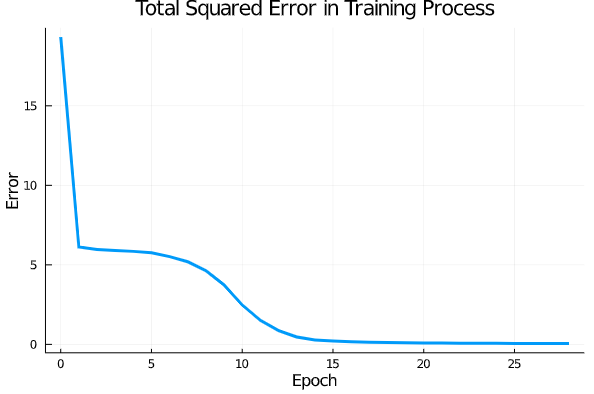

# Simple Credit Check System

## Table of contents

- [Description](#Description)
- [Structure of the neural network](#Structure-of-the-neural-network)
- [Data in this project](#Data-in-this-project)
- [Files in this repo](#Files-in-this-repo)
- [Result](#Result)
- [Dependencies for this project](#Dependencies-for-this-project)
- [Download the code](#Download-the-code)

## Description

Nowadays, running credit checks on customers becomes an essential step in many situations,
including house renting, bank loaning, credit card application, etc. Doing the credit check can
avoid serving the customer who is not creditable. Having learned the neural network, I decide to build up a two-layer neural network, which is used to classify the customers
as the person with good credit and the person with bad credit.


## Structure of the neural network

The neural network implemented in this project has an input layer, a hidden layer, and a output layer. The input layer has five neurons including a bias term. The hidden layer has four neurons including a bias term. The output layer has one neuron only. The bias terms in input layer and hidden layer is used to help the neural network best fit for the input data. The structure of the neural network is depicted in the following image:


## Data in this project

The original dataset in this project is publicly available on the [UCI Machine Learning Repository](https://archive.ics.uci.edu/ml/datasets/statlog+(german+credit+data)).


## Files in this repo

This GitHub repo contains the following folders or files

+ `data` folder contains the processed data used in the final project and the training data used in the prototype stage of this project

+ `img` folder contains the training result images, neural network structure image, and the final tesing result image

+ `src` folder contains the source code for this project

+ `test` folder contains the testing code for this project

+ `LICENSE` is a MIT license. The license is created so that others have the permission to use the code in this repo


## Result

### Training result

The training result is shown in a parameter called error rate. The error rate is store after each epoch is finished. The whole training process is not going to be terminated until the error rate is not greater than a threshold value. The threshold value is an accepted error rate, and in this project, the value is 5%

The following image shows a random training reuslt of the neuron network, which only takes 29 epochs:



The following image shows the worst case of the training result, which takes 46 epochs:


Overall, the training result is good as expected, since it only takes less than 50 epochs to get the error rate below the accepted value.

### Testing result

The tesing result if about sending all the testing dataset to the trained neural network and compare the output of the neural network with the expected output. In each single test, if the output of the neural network is within ±5% of the expected output, then the test is considered as successful. After all the validation data have been tested, a successful rate (accuracy) of the neural network will be computed. From the image below, the accuracy can reach 97%, which is highly beyond expectation.


## Dependencies for this project

In order to run the source code smoothly, one has to type in the following code and install the follwing Julia packages:

```julia
using Pkg; Pkg.add(["DataFrames", "CSV", "Plots", "Distributions", "Test"])
```


## Download the code

One can download all the code files in this repository by cloning this repo

```bash
git clone https://github.com/zhaoshengEE/Credit_Check_System.git
```
