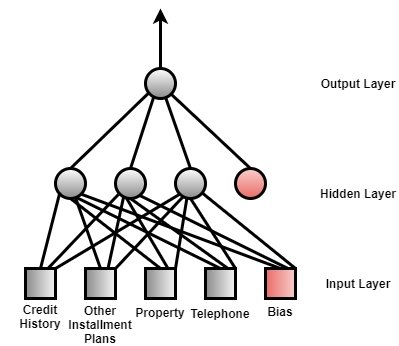

Let's load some packages that is necessary for this project first

```julia
using DataFrames, CSV # For loading data
using Plots # For plotting the total error in training process
using Distributions # For generating weights
```

Before diving into this project, I do some pre-possessing on the original dataset, which is publicly available on the [UCI Machine Learning Repository](https://archive.ics.uci.edu/ml/datasets/statlog+(german+credit+data)).
I select some inputs and convert all the data into binary format. The table below illustrates the four selected inputs and the output of the neural network, along with their meanings in the binary format.

|            |      0      |      1       |
|:----------: | :-----------: |:------------:|
| Credit history | Had delay in paying off credit | All credits are paid back |
| Other installment plans | Not have other installment plans | Have other installment plans |
| Property | Not have other properties | Have other properties |
| Telephone | Not have registered telephone number | Have registered telephone number |
| Output | Bad credit | Good credit |

Also in the neural network, I decide to add bias terms in input layer and hidden layer. The bias terms can help the neural network fit best for the input data.

The image below shows the structure of the neural network I am implementing in this project:


I also assign other two variables called learningRate and momentum resepcitvely. The leanringRate is the learning speed of the nerual network and should not be too large. A large learning rate can lead to oscillations during the training process.
In this case, I assign a relatively small value to the learningRate and assign a relatively large value to the momentum. The momentum is used to motivate the learning of the neural network.

```julia
argA = 0
argB = 1
bias = 1

inputNum = 5
hiddenNum = 4
outputNum = 1
momentum = 0.9
learningRate = 0.2
```

An activation function is another essential element in a neural network. Here I provide two types of activation functions, one is the sigmoid function, the other is the ReLU function.
In this project, I am implementing the sigmoid function as activation function. In the future development on this project, one can try using the ReLU function as activation function.

```julia
###  Activation Function (Sigmoid)  ###
function sigmoid(x::Float64)
    result = (argB - argA) / (1 + exp(-x)) + argA
    return result
end

###  Activation Function (ReLU)  ###
function ReLu(x::Float64)
    result = max(0.0, x)
    return result
end
```

Then I start writing the training function, which consists of forward propagation function (`outputFor` function) and backpropagation function (`updateWeight` function).
The `train` function is going to be called a bunch of times during the training process, it returns the error between the training output and the expected output.
The error is calculated in the formula below:
```math
f(a) = \frac{1}{2}\int_{0}^{2\pi} (\alpha+R\cos(\theta))d\theta
```
$$x_{1,2} = {-b\pm\sqrt{b^2 - 4ac} \over 2a}.$$